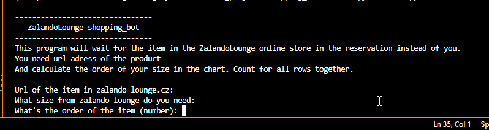
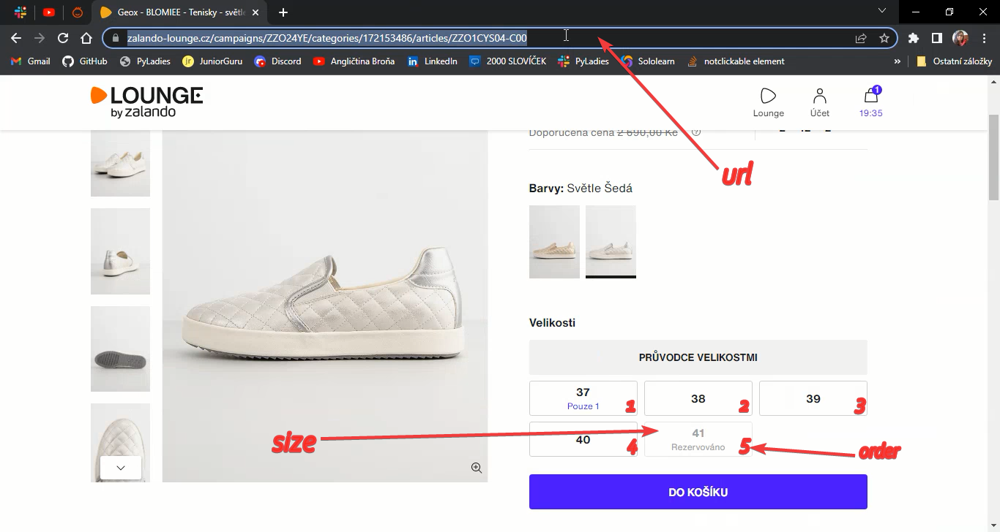

# 🎁 Shopping Bot
***

Shopping Bot is a tool for shopping on zalando-lounge.cz. If the item you want is reserved by another customer, Shopping Bot will check if the item has been returned or sold. 

With the help of this tool, you can:
- go to the site zalando-lounge.cz 
- log in via your Google account 
- select an item 
- when the item is reserved, it refreshes the page 
- once the item is available, it adds it to your cart and plays a notification sound 
- if the item is sold out, it will print a message and play a notification sound 

## 📦 Prerequisites

- python 3.11.1
- selenium 4.8.2 - pip install selenium 
- google chrome 111.0.5563.65 
- chromedriver   
- undetected-chromedriver 3.4.6 - pip install undetected-chromedriver 
- playsound 1.2.2 (playsound 1.3.0 doesn't work) - pip install playsound==1.2.2 
- google account

## 📦 Installation
1. [Click here to download the ZIP project.](https://github.com/LuckaSokolka/Shopping-Bot/archive/refs/heads/main.zip)
2. In the same folder, create a file called log.py
3. Input your Google email and password for your Google account in log.py with the following code: 

    email = "xxxxx"  # only the part before @gmail.com 
    password_gmail = "xxxxx" 

4. Run the file main.py

## 🚀 How to use
After starting the program, input the following data about the item you want to purchase: 

## Example
You can see [how it works](https://youtu.be/J2wq6aRW_E4) in this video.

